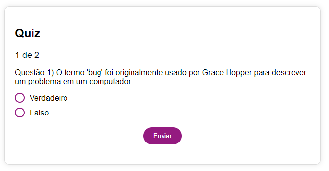
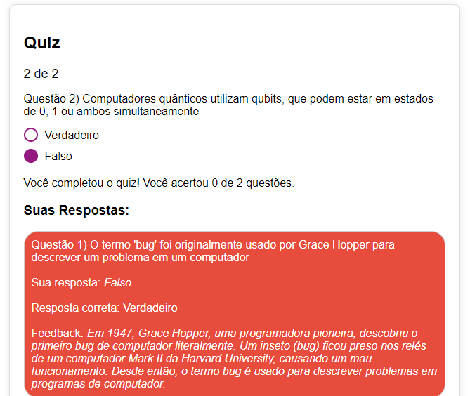

# Quiz interativo

Este é um exemplo de um quiz interativo utilizando HTML, CSS e JavaScript.

## Funcionalidades

- Apresenta duas perguntas com opções de resposta.
- Permite ao usuário selecionar uma resposta para cada pergunta.
- Fornece feedback após cada resposta.
- Mostra o resultado final do quiz após todas as perguntas serem respondidas.
- Permite ao usuário revisar todas as respostas dadas.

## Como Usar

1. Clone este repositório.
2. Abra o arquivo `index.html` em um navegador web para iniciar o quiz.
## Imagens

## Contribuições

Contribuições são bem-vindas! Sinta-se à vontade para enviar pull requests para melhorar este quiz ou adicionar novos recursos.

